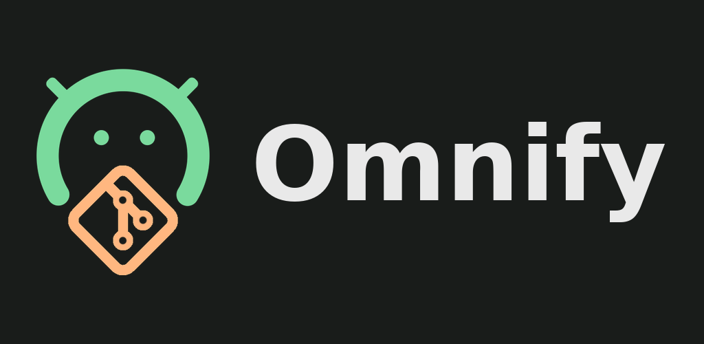

> [!WARNING]
> **Free and Open-Source Android is under threat.**
> Google plans to make Android more locked-down, restricting your freedom to install the apps of your choice.
> Make your voice heard: [**Keep Android Open**](https://keepandroidopen.org/).

<div align="center">



### Omnify

**A clutter-free F-Droid client that also installs apps from anywhere.**

_Omnify, maintained by [Victor-root](https://github.com/Victor-root), based on [Droid-ify](https://github.com/Droid-ify/client) by LooKeR._

</div>

---

## 📸 Screenshots

<p align="center"><strong>📱 Mobile</strong></p>
<p align="center">


</p>

<p align="center"><strong>📺 Android TV</strong></p>
<p align="center">
  
</p>

---

## ✨ Highlights

### 📦 Install apps from anywhere (*External sources*)

Add a project's **GitHub, GitLab, Codeberg, or self-hosted Gitea/Forgejo**
releases as a source and install & update its app with **no F-Droid repository
required**. Track a whole publisher account at once instead of one project at a
time.

- Automatically picks the right APK for your CPU architecture (with an optional
  name filter), and falls back to an older release if the latest has none
  compatible.
- Shows the real app name and icon **before** installing, with a visual icon
  picker.
- Update notifications in the Updates tab, signature-conflict handling, and the
  project README rendered in-app.
- Per-source settings (custom name, pre-releases, mute), an optional no-scope
  GitHub token to lift the API rate limit, and included in your backup.
- **Omnify's picks**: a curated list of noteworthy sources, disabled by
  default, one tap away.

### 📺 Made for Android TV

A proper 10-foot interface, not an afterthought: full D-pad navigation, a
scaled-up UI, automatic "Made for TV" detection for both catalogue and
external apps, and a curated pack of FOSS TV apps ready to install.

### 🎨 Modern Material You interface

Rebuilt in **Jetpack Compose** with **Material 3**: an accent-colour picker
(including a wallpaper-based option, or matching an app's own icon on its
detail page), tinted system bars, an edge-to-edge mode, a collapsing header,
a two-column grid, animated search and wavy progress indicators.

### 🧭 Discover home

A curated landing screen with carousels (what's new, recently updated, most
downloaded) and a browsable categories section.

### 👁️ Hide apps you don't need

Hide any app, catalogue or external, from every list (Discover, Installed,
Updates) with one tap on its page. Manage what's hidden, or bring an app
back, from Settings.

### 🌍 Built-in translation

Translate an app's **summary and description** into your language, with a choice
of **online**, **self-hosted**, or **fully offline on-device** engines. An
optional auto-translate toggle does it for you, and nothing is downloaded until
you pick the on-device engine.

### 💾 Backup & restore

Back up repositories, external sources, settings, favourites and custom
buttons independently, all in one file. Restoring only ever adds to what's
already there, never wipes it.

---

## 🛡️ Security & privacy

- Signing certificate **verified against the repository index before any install**,
  with the installed and expected fingerprints viewable and copyable on the
  detail screen.
- Anti-feature warnings and the full runtime-permission list on the detail screen.
- A badge flags apps that depend on **proprietary Google services**, and how
  well **microG** covers what they actually need.
- Recovers an app's real supported languages even when its own listing doesn't
  declare them.
- The optional GitHub token is **scope-less** (it only lifts the rate limit), and
  translation can run **fully offline**.

---

## 🔧 Stability & bug fixes

**Performance**
- Unified the data layer on a single **Room** database, removing the legacy
  SQLite store, sync service, downloader and index parser.
- Moved list and screen-state work **off the main thread**, added a **baseline
  profile** for faster cold starts, and fixed a **freeze (ANR)** on the detail
  screen.

**Large catalogues & sync**
- Oversized repository rows no longer exceed the SQLite cursor-window limit that
  could crash the list.
- Reliable sync: auto re-sync after a database reset, no more silent
  empty-catalogue syncs, a fresh index file each time, and a clear fetching state
  on first launch. The foreground notification is throttled so it no longer
  flickers.

**Updates & installs**
- Hides system-app updates that can't be installed and stops the uninstall-prompt
  loop for differently-signed system apps.
- Reuses an already-downloaded APK after a signature-conflict uninstall, with no
  needless re-download.

---

## 🚀 Get started

**Download:** the latest APK from
[**GitHub Releases**](https://github.com/Victor-root/Omnify/releases/latest).
**Build from source:** see the [Building Guide](docs/building.md).

> Requires Android 6.0 (API 23) or newer. Ships in English and full (formal)
> French, with the other languages inherited from upstream.

**Verify:** every release is signed with the same certificate. Compare its
SHA-256 fingerprint (e.g. via `apksigner verify --print-certs`) against:

```
F2:2B:D7:B4:63:D8:D8:9C:A1:AC:3B:6C:41:DB:0B:25:AA:C7:7B:86:24:C9:70:E4:52:81:2D:32:19:42:A9:71
```

---

## Why this fork?

I use Droid-ify every day, intensively, and over time I ran into bugs and wanted
features that really mattered for that kind of daily use. I proposed fixes
upstream, but many of them were built with AI assistance, and the
[Droid-ify](https://github.com/Droid-ify/client) project has chosen to stay
AI-free. That is entirely their decision to make, so those fixes couldn't be
merged. Forking was the only way for me to keep improving the app at my own pace.

**To be clear, this is not a fork against Droid-ify.** I have deep respect for the
original project, its author and its vision for the codebase. Omnify
simply serves a different need, my own, and only exists because Droid-ify gave it
such a strong foundation.

---

## 🙏 Built on the shoulders of giants

- **[Droid-ify](https://github.com/Droid-ify/client)** by **LooKeR**: the base this fork builds on.
- **[Foxy-Droid](https://github.com/kitsunyan/foxy-droid)** by **kitsunyan**: the client Droid-ify itself grew from.

Huge thanks to both projects and their contributors. Contributions here are
welcome too. Start with the [Contributing Guide](CONTRIBUTING.md).

---

## 📄 License

```
Omnify, a fork of Droid-ify

Copyright (C) 2025 LooKeR (original Droid-ify)
Copyright (C) 2026 Victor-root (Omnify fork)

This program is free software: you can redistribute it and/or modify
it under the terms of the GNU General Public License as published by
the Free Software Foundation, either version 3 of the License, or
(at your option) any later version.

This program is distributed in the hope that it will be useful,
but WITHOUT ANY WARRANTY; without even the implied warranty of
MERCHANTABILITY or FITNESS FOR A PARTICULAR PURPOSE. See the
GNU General Public License for more details.

You should have received a copy of the GNU General Public License
along with this program. If not, see <http://www.gnu.org/licenses/>.
```
